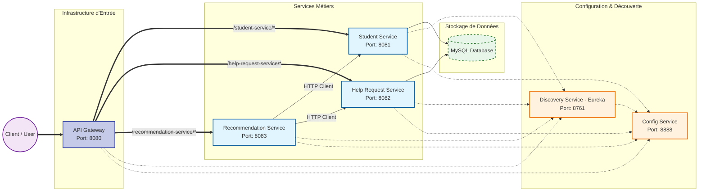

# Rapport SOA: Plateforme d'Entraide

## 1. Introduction et Objectifs

Ce document détaille l'architecture technique d'une application d'entraide intelligente destinée aux étudiants.
L'objectif est de créer une communauté d'apprentissage pair-à-pair favorisant la solidarité sur les campus. La
plateforme permet la mise en relation entre étudiants demandeurs et étudiants compétents via un système de
recommandation automatisé.

L'architecture retenue est une architecture **Microservices** utilisant l'écosystème **Spring Boot** et
**Spring Cloud**, avec une base de donnée relationnelle **MySQL**.

## 2. Architecture Globale

Le système est découpé en services fonctionnels (métier) et en services d'infrastructure (support). L'ensemble des
communications externes transite par une porte d'entrée unique (Gateway).

### Diagramme des Composants

## 3. Stack Technique

* **Langage & Framework :** Java, Spring Boot.
* **Orchestration Microservices (Spring Cloud) :**
    * **Config Server :** Gestion centralisée de la configuration via Git.
    * **Eureka Discovery :** Registre de services pour la découverte dynamique.
    * **API Gateway :** Point d'entrée unique et routage.
* **Communication Inter-services :** WebClient (appels synchrones via REST).
* **Sécurité :** JWT (JSON Web Tokens) avec clé secrète partagée.
* **Base de données :** MySQL unique (partagée) avec Hibernate/JPA pour le mapping ORM.

## 4. Description Détaillée des Services

### 4.1. Services d'Infrastructure

#### Config Service (Port 8888)

Il centralise les fichiers de configuration (`application.properties`) de tous les microservices. Il est connecté à un
dépôt Git distant pour assurer le versionnage des configurations.

#### Discovery Service (Port 8761)

Il s'agit d'un serveur Eureka. Chaque microservice s'y enregistre au démarrage, ce qui permet à la Gateway et aux autres
services de localiser les instances via leurs noms logiques (`lb://<nom-du-service>`).

#### API Gateway (Port 8080)

Point d'entrée unique de l'application. Ses responsabilités incluent :

* **Routage :** Redirection des requêtes vers les services appropriés (`/student-service`, `/help-request-service`,
  `/recommendation-service`).
* **Sécurité (Filtre Global) :** Vérification de la validité du Token JWT.
* **Propagation de contexte :** Injection des en-têtes `X-User-Id` et `X-User-Email` vers les services en aval après
  validation de l'identité.

### 4.2. Services Fonctionnels (Métiers)

#### Student Service (Port 8081)

Ce service gère l'identité et le profil des utilisateurs.

* **Fonctionnalités :**
    * Inscription et Authentification (génération du JWT).
    * Gestion du profil étudiant : état civil, établissement, filière.
    * Gestion des compétences (mots-clés) et disponibilités.
    * Gestion des avis (Reviews) donnés et reçus.
* **Données :** Entités `Student` et `Review`.

#### Help Request Service (Port 8082)

Ce service gère le cycle de vie des demandes d'aide.

* **Fonctionnalités :**
    * Création de demandes (Titre, description, date souhaitée, mots-clés).
    * Workflow de statut : `WAITING`, `IN_PROGRESS`, `DONE`, `ABANDONED`, `CLOSED`.
    * Assignation d'un aidant à une demande.
    * Recherche et filtrage des demandes.
* **Données :** Entité `HelpRequest`.

#### Recommendation Service (Port 8083)

Ce service intelligent identifie les profils les plus pertinents pour une demande donnée.

* **Fonctionnement :** Il n'a pas de base de données propre. Il interroge `student-service` et `help-request-service`
  pour récupérer les données nécessaires.
* **Algorithme de Scoring :**
    * **Compétences (40%) :** Correspondance entre les mots-clés de la demande et les compétences de l'étudiant.
    * **Réputation (40%) :** Basée sur la moyenne des avis reçus.
    * **Disponibilité (20%) :** Bonus si l'étudiant a déclaré des disponibilités.

## 5. Sécurité et Flux d'Authentification

La sécurité repose sur un modèle stateless via JWT.

1. **Authentification :** L'utilisateur envoie ses identifiants à l'endpoint `/auth/login` du `student-service`. Si
   valides, le service retourne un token JWT signé avec une clé secrète partagée.
2. **Autorisation :** Pour toute requête suivante, le client envoie le JWT dans l'en-tête `Authorization`.
3. **Validation :** L'API Gateway intercepte la requête, valide la signature et l'expiration du token via
   `JwtAuthGlobalFilter`.
4. **Propagation :** Si le token est valide, la Gateway extrait l'ID utilisateur et l'ajoute dans l'en-tête HTTP
   `X-User-Id` avant de transférer la requête au microservice concerné. Les services métiers utilisent cet en-tête pour
   identifier l'utilisateur courant sans re-vérifier le token.

## 6. Stockage de Données

Bien que l'architecture soit distribuée, le choix a été fait d'utiliser une **base de données MySQL unique** (
`projet_gei_062`) pour simplifier le développement et le déploiement dans le cadre académique.

* Les tables sont préfixées ou distinctes par domaine (`student`, `help_request`).
* Le service de recommandation agit comme un agrégateur et ne stocke donc pas de données métier propres.
* Un ORM (Hibernate) est utilisé en mode `ddl-auto=update` pour la gestion du schéma.

## 7. Conclusion

Cette architecture répond aux exigences fonctionnelles de gestion des étudiants, des demandes d'aide et de la mise en
relation intelligente. La séparation en microservices permet une évolutivité des composants (notamment le moteur de
recommandation) et l'utilisation de Spring Cloud assure la robustesse de la communication et de la configuration du
système distribué.
